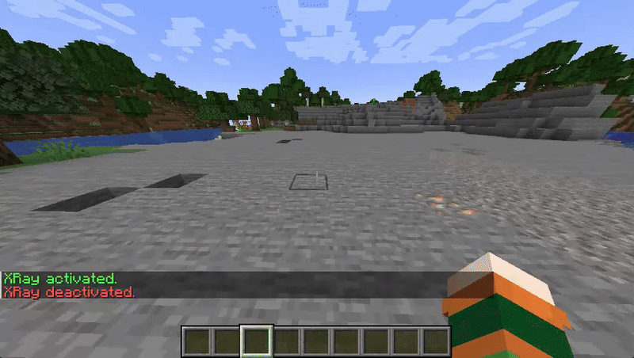
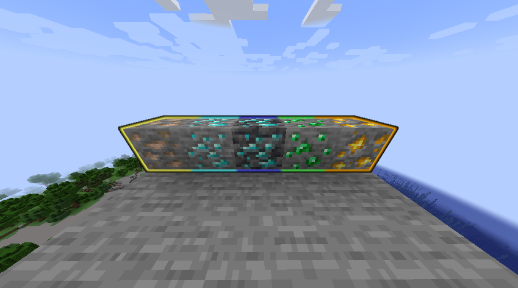

# ServerXRay

A fully customizable **XRay plugin for Minecraft servers**. Highlight specific ores with configurable colors per block, control the scan radius and update interval, and provide players or staff with a clean XRay visualization without client modifications.



---

## Features

* Enable or disable XRay with `/xray`
* Per-block customizable highlight colors
* Asynchronous block scanning (performance friendly)
* Fully configurable through `config.yml`
* Lightweight and focused on gameplay utility

---

## Installation

1. Download the latest `ServerXRay.jar` and place it in your server's `plugins/` folder
2. Make sure [ProtocolLib](https://www.spigotmc.org/resources/protocollib.1997/) is installed
3. Restart the server

---

## Configuration

```yaml
xray:
  radius: 30              # Search radius in blocks
  interval: 40            # Refresh interval in ticks (20 ticks = 1 second)
  highlights:
    DIAMOND_ORE: AQUA
    DEEPSLATE_DIAMOND_ORE: BLUE
    IRON_ORE: YELLOW
    GOLD_ORE: GOLD
    EMERALD_ORE: GREEN
```



---

## Commands

| Command | Description           | Permission |
| ------- | --------------------- | ---------- |
| `/xray` | Toggle XRay on or off | `xray.use` |

---


## @TODO:

* `/xray reload` to re-read configuration without restart
* Per-player radius override via command or GUI
* Optional cooldown system per player
* GUI for block selection and preview
* API for plugin developers
* World-based configuration support
* Maximum number of players with XRay active at once
* Customizable messages via `messages.yml`
* Smart caching system
* Chunk-based scanning instead of cubic radius
* Compatibility with older Minecraft versions

---

## License

MIT License © 2025 [Lucas Santoro](https://github.com/lucas-santoro)

---

## Author

> Developed by **Lucas Santoro** — feel free to contribute or report issues on GitHub!
